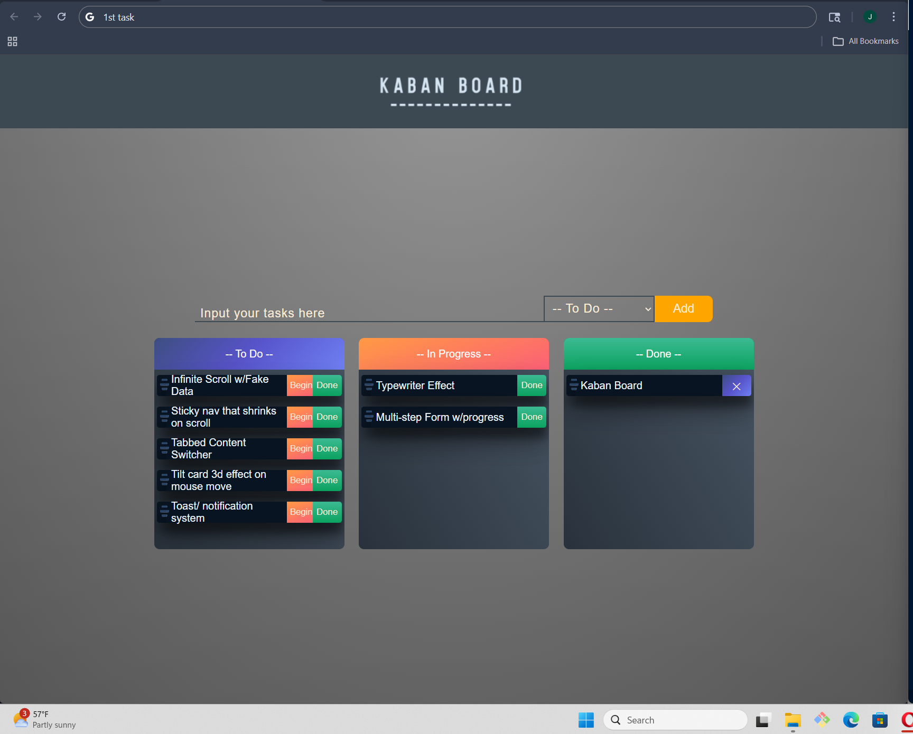

# Drag N' Drop Kanban Board

A simple and interactive Kanban board built with vanilla JavaScript, allowing users to organize tasks by dragging and dropping them between different columns.

This project demonstrates how to implement a fully functional drag-and-drop system using the native browser HTML Drag and Drop API, which enables elements to be moved and handled via events like dragstart, dragover, and drop.

Live Demo:

---

## Features

- Drag and drop tasks between columns
- Multiple task columns (e.g., To Do, In Progress, Done)
- Real-time UI updates
- (Optional if implemented) Local storage persistence
- Clean and responsive UI

---

## Tech

- HTML5
- CSS3
- JavaScript (Vanilla)
- Native Drag & Drop API

## How It Works

This project uses the browser’s built-in drag-and-drop system:

- dragstart → fires when dragging begins
- dragover → allows dropping by preventing default behavior
- drop → handles placing the element in a new column

Tasks can be picked up and dropped into different sections, updating their position dynamically.

---

## 🚀 Getting Started

To run the project locally:

### 1. Clone the repo

```bash
git clone https://github.com/J-Magee0/JavaScript-projects/tree/main/Drag-N-Drop_Kaban-board
cd projectName
```

### Screenshots


