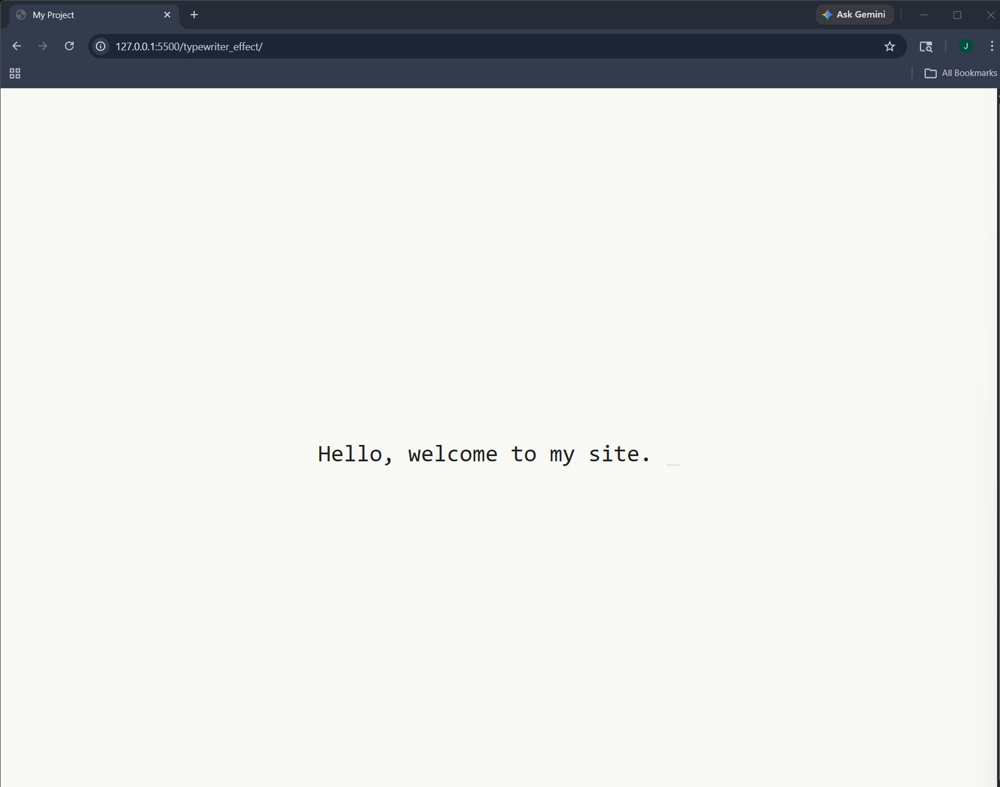

# Typewriter Effect

A minimal and elegant typewriter animation built with vanilla JavaScript, featuring a blinking underscore cursor and smooth character-by-character text rendering.

Designed with a clean off-white UI, this project mimics a terminal-style typing experience while keeping the implementation lightweight and easy to understand.

---

## Features

- Realistic typewriter animation
- Character-by-character text rendering
- Blinking underscore cursor (\_)
- Minimal and clean UI design
- Lightweight (no libraries required)
- Responsive and centered layout

---

## Tech Stack

- HTML5
- CSS3
- JavaScript (Vanilla)

---

## How It Works

The typewriter effect is achieved by:

- Iterating through a string one character at a time
- Updating the DOM dynamically using JavaScript
- Using setTimeout to control typing speed
- Applying CSS animations to create a blinking cursor

---

## Getting Started

Clone the repo

```bash
git clone git clone https://github.com/J-Magee0/typewriter_effect.git
cd projectName
```

### Screenshots


